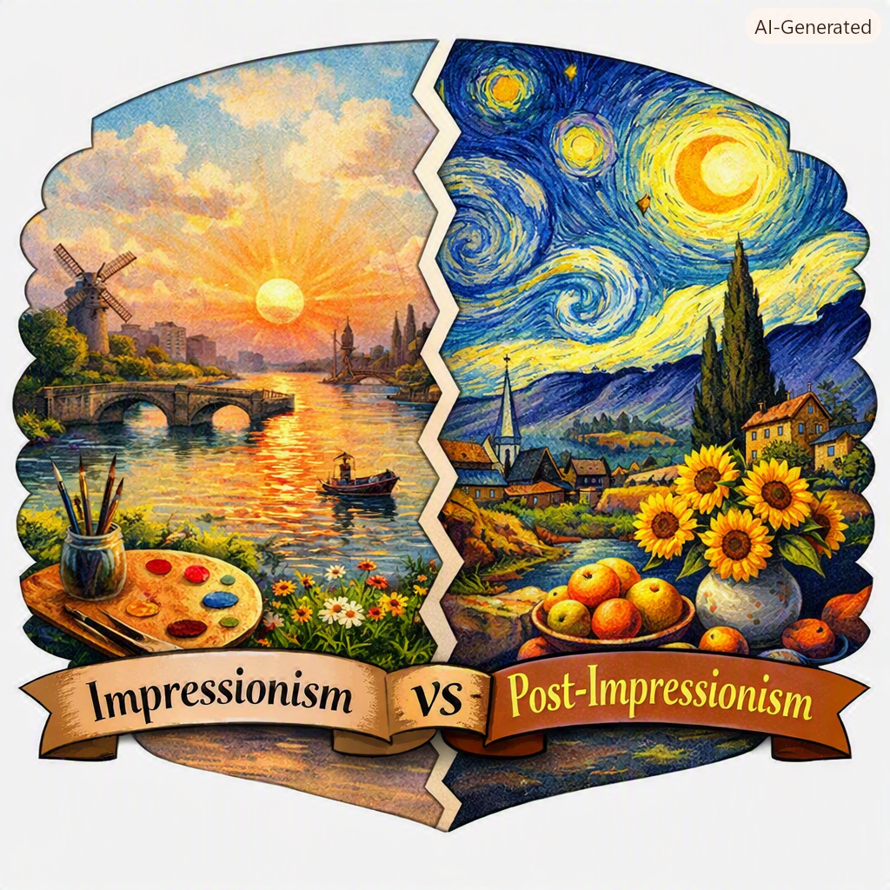

### Impressionism and Post‑Impressionism: From Fleeting Light to Personal Vision

#### 🌍 Introduction
Impressionism and Post‑Impressionism are two closely connected art movements that transformed painting in the late 19th and early 20th centuries. They both broke away from traditional realism, but each had a different goal: **Impressionism** wanted to capture the fleeting impression of light and color, while **Post‑Impressionism** wanted to go beyond that impression to add structure, symbolism, and personal meaning.  

Let’s explore them in **plain English**, with examples, analogies, and stories — about 2,500 words worth of explanation — so you can see how they differ and why they matter.

### 🎨 Part I: Impressionism
##### 1. The Basics
- **Timeframe**: 1860s–1880s.  
- **Core Idea**: Paint the *impression* of a moment — how light and color feel, not how objects truly look.  
- **Style**: Quick brushstrokes, bright colors, outdoor scenes, natural light.  

##### 2. Why It Emerged
- Photography had arrived, making realistic painting less necessary.  
- Artists wanted to capture the *experience* of seeing, not just the details.  
- Paris was changing rapidly — new boulevards, cafés, and leisure activities inspired painters to depict modern life.  

##### 3. Famous Artists
- **Claude Monet** — *Impression, Sunrise* (1872), the painting that gave the movement its name.  
- **Pierre‑Auguste Renoir** — lively scenes of people dancing, socializing, enjoying life.  
- **Camille Pissarro** — city streets and rural landscapes painted with shimmering light.  

##### 4. Example
Imagine standing by a river at dawn. The water glimmers, the sky glows pink, and everything feels alive. Impressionism paints that *feeling* — not the exact details, but the shimmering impression.

👉 Analogy: Impressionism is like a **low‑resolution photo taken in beautiful light** — soft, emotional, alive.

#### 🌀 Part II: Post‑Impressionism
##### 1. The Basics
- **Timeframe**: 1880s–1910s.  
- **Core Idea**: Go beyond fleeting impressions — add structure, emotion, and symbolism.  
- **Style**: Stronger outlines, bolder colors, more personal expression.  

##### 2. Why It Emerged
- Some artists felt Impressionism was too superficial — just surface light and color.  
- They wanted to express deeper meaning, inner feelings, or symbolic truths.  
- Each Post‑Impressionist developed a unique style, but all shared dissatisfaction with Impressionism’s limits.  

##### 3. Famous Artists
- **Vincent van Gogh** — *Starry Night* (1889), swirling skies expressing inner turmoil.  
- **Paul Cézanne** — simplified forms into geometric shapes, paving the way for Cubism.  
- **Paul Gauguin** — flat shapes and symbolic colors inspired by Tahitian culture.  
- **Georges Seurat** — pointillism, using dots of color to build structure.  

##### 4. Example
Imagine looking at the same river at dawn. Instead of just shimmering light, you see swirling patterns that reflect your emotions, or geometric shapes that suggest deeper order. Post‑Impressionism paints not just what the eye sees, but what the mind feels.

👉 Analogy: Post‑Impressionism is like a **medium‑resolution image with artistic filters** — clearer than Impressionism, but stylized to express thought and emotion.

#### 📊 Part III: Comparison
| Feature              | Impressionism                        | Post‑Impressionism                     |
|----------------------|--------------------------------------|----------------------------------------|
| **Focus**            | Fleeting light, surface impressions  | Structure, symbolism, personal vision   |
| **Style**            | Quick brushstrokes, soft edges       | Strong outlines, bold colors            |
| **Mood**             | Bright, lively, atmospheric          | Emotional, thoughtful, expressive       |
| **Examples**         | Monet’s *Impression, Sunrise*        | Van Gogh’s *Starry Night*, Cézanne      |
| **Analogy**          | Low‑resolution photo                 | Medium‑resolution artistic filter       |

#### ⚙️ Part IV: Plain English Analogies
##### Computer Analogy
- **Impressionism** = capturing the *light data* — fast rendering, soft edges, emotional pixels.  
- **Post‑Impressionism** = adding *processing and structure* — more layers, more meaning, more deliberate composition.  

##### Everyday Analogy
- **Impressionism** is like writing a quick diary entry about how the sunset looked.  
- **Post‑Impressionism** is like writing a poem about what that sunset *means* to you.  

#### 🌠 Part V: Why They Matter
- Impressionism broke the rules of traditional painting, showing that art could capture fleeting experiences.  
- Post‑Impressionism pushed further, showing that art could express inner emotions and personal visions.  
- Together, they opened the door to modern art movements like Cubism, Expressionism, and Abstract art.  

#### ✨ Conclusion
In plain English:  
- **Impressionism** paints **what the eye sees** — shimmering light, fleeting impressions.  
- **Post‑Impressionism** paints **what the mind feels** — deeper meaning, symbolism, personal vision.  

👉 Example takeaway:  
- Impressionism says: *“Here’s how the light looks.”*  
- Post‑Impressionism says: *“Here’s how the world feels to me.”*  

### EOF
