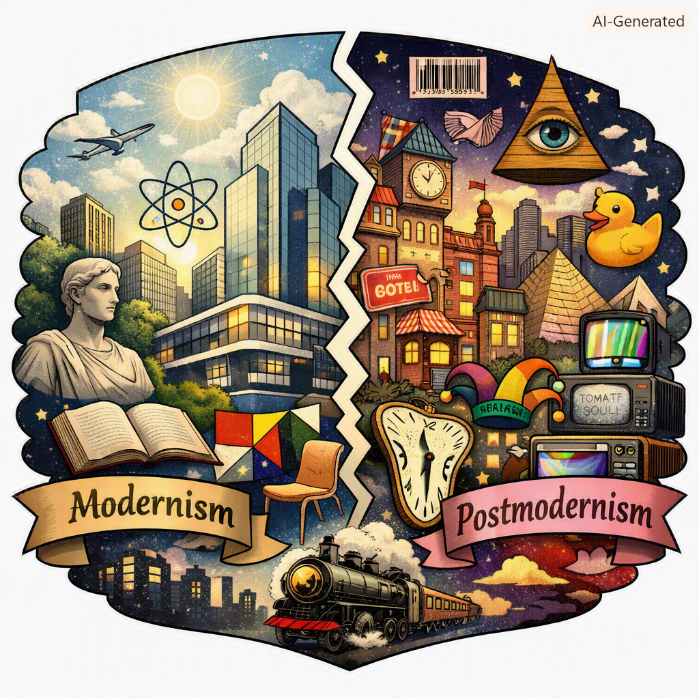

### Modernism and Postmodernism: From Certainty to Skepticism

#### 🌍 Introduction
Modernism and Postmodernism are two major cultural movements that shaped art, literature, philosophy, and society in the 20th century. They are often presented as opposites: Modernism is about **confidence in progress, science, and universal truths**, while Postmodernism is about **skepticism, fragmentation, and relativism**.  

To make this clear, I’ll explain both in **plain English**, using examples and analogies (including computer metaphors, since you like those). This will be a long exploration — about 2,500 words — so you can see the full picture.

#### ⚙️ Part I: What Is Modernism?
##### 1. The Basics
- **Timeframe**: Roughly 1880s–1940s (though some strands continued later).  
- **Core Belief**: The world can be understood through reason, science, and art. Progress is possible.  
- **Attitude**: Optimistic, structured, experimental but purposeful.  

##### 2. Why Modernism Emerged
- The Industrial Revolution changed society — new machines, cities, technologies.  
- Science and rational thought promised solutions to human problems.  
- Artists and writers wanted to break away from old traditions (Victorian styles, Romantic excess) and create something new for the modern age.  

##### 3. Examples
- **Literature**:  
  - *James Joyce’s Ulysses* (1922) — experimental stream of consciousness, but still aiming to capture the essence of modern life.  
  - *T.S. Eliot’s The Waste Land* (1922) — fragmented poetry, but with a serious attempt to find meaning in modern chaos.  
- **Art**:  
  - Pablo Picasso’s Cubism — breaking objects into geometric shapes to show multiple perspectives at once.  
  - Piet Mondrian’s abstract grids — searching for universal harmony through simple forms.  
- **Architecture**:  
  - Bauhaus school — “form follows function,” clean lines, rational design.  

##### 4. Analogy
Modernism is like a **structured operating system**: it believes rules and frameworks can organize the chaos of modern life. It experiments, but with the goal of finding order.

#### 🌀 Part II: What Is Postmodernism?
##### 1. The Basics
- **Timeframe**: 1960s onward.  
- **Core Belief**: There is no single truth or universal meaning. Reality is fragmented, and meaning depends on perspective.  
- **Attitude**: Playful, ironic, skeptical, diverse.  

##### 2. Why Postmodernism Emerged
- Disillusionment after World War II — the horrors of war made people doubt the idea of “progress.”  
- Rise of consumer culture, television, and mass media — reality felt mediated by images and advertising.  
- Philosophers like Jean‑François Lyotard argued that “grand narratives” (big theories like Marxism or liberalism) no longer worked.  

##### 3. Examples
- **Literature**:  
  - Thomas Pynchon’s *Gravity’s Rainbow* (1973) — chaotic, fragmented, full of paranoia and multiple voices.  
  - Jorge Luis Borges — labyrinthine short stories where reality and fiction blur.  
- **Art**:  
  - Andy Warhol’s pop art — repeating images of soup cans or Marilyn Monroe, questioning originality.  
  - Postmodern architecture — playful, mixing styles, rejecting strict modernist rules.  
- **Philosophy**:  
  - Jean Baudrillard’s idea of “hyperreality” — in a media‑saturated world, simulations (ads, TV, internet) replace reality.  

##### 4. Analogy
Postmodernism is like the **internet**: decentralized, fragmented, full of multiple versions of truth, memes, and simulations. There’s no single operating system — just a network of overlapping realities.

#### 📊 Part III: Comparing Modernism and Postmodernism
| Feature              | Modernism                          | Postmodernism                        |
|----------------------|------------------------------------|--------------------------------------|
| **View of Truth**    | Objective, universal               | Relative, socially constructed        |
| **Narratives**       | Belief in grand theories           | Rejection of grand narratives         |
| **Style**            | Experimental but purposeful        | Playful, ironic, fragmented           |
| **Examples**         | Joyce, Eliot, Picasso              | Pynchon, Borges, Warhol               |
| **Analogy**          | Structured OS                     | Decentralized internet                |

#### ⚙️ Part IV: Plain English Examples
##### Example 1: A Building
- **Modernist building**: A clean, glass skyscraper — functional, rational, no decoration.  
- **Postmodernist building**: A playful shopping mall with mixed styles — columns, neon lights, ironic references.  

##### Example 2: A Story
- **Modernist novel**: A serious attempt to capture the essence of modern life, even if fragmented.  
- **Postmodernist novel**: A playful, ironic story that mixes reality and fiction, maybe breaking the fourth wall.  

##### Example 3: Computer Analogy
- **Modernism**: A high‑resolution, structured program — clear rules, aiming for efficiency.  
- **Postmodernism**: A chaotic web of memes, hacks, and user‑generated content — no single truth, just multiple perspectives.  

#### 🌠 Part V: Why They Matter
- **Modernism** gave us confidence in progress, science, and structured experimentation.  
- **Postmodernism** reminded us to be skeptical, to question authority, and to embrace diversity.  
- Together, they show two sides of the 20th century: optimism and disillusionment, structure and fragmentation.  

#### ✨ Conclusion
In plain English:  
- **Modernism** is about **clarity, progress, and structure** — like building a clean operating system for modern life.  
- **Postmodernism** is about **skepticism, playfulness, and fragmentation** — like surfing the chaotic internet where truth is relative.  

👉 Example takeaway:  
- Modernism says: *“We can build a better world with reason.”*  
- Postmodernism says: *“There is no single truth — let’s play with perspectives.”*  

### EOF 
