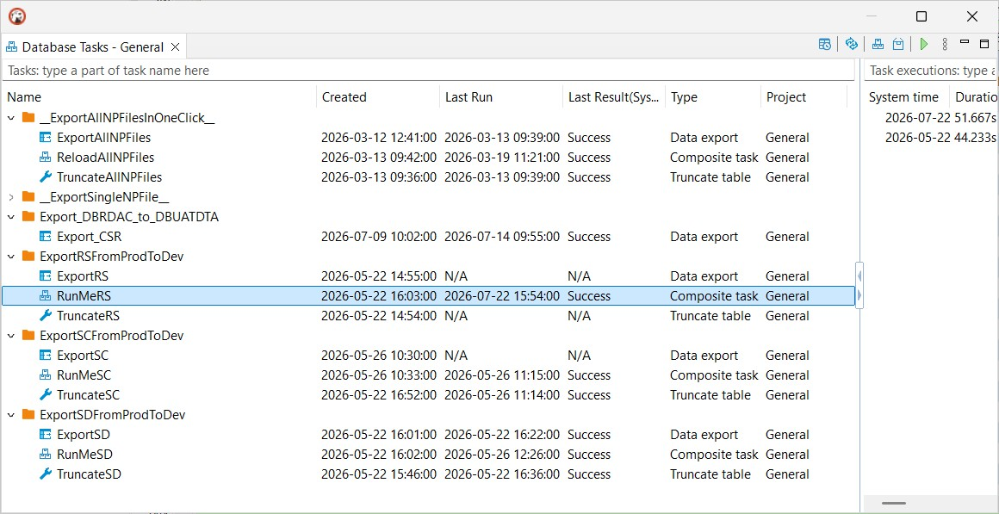
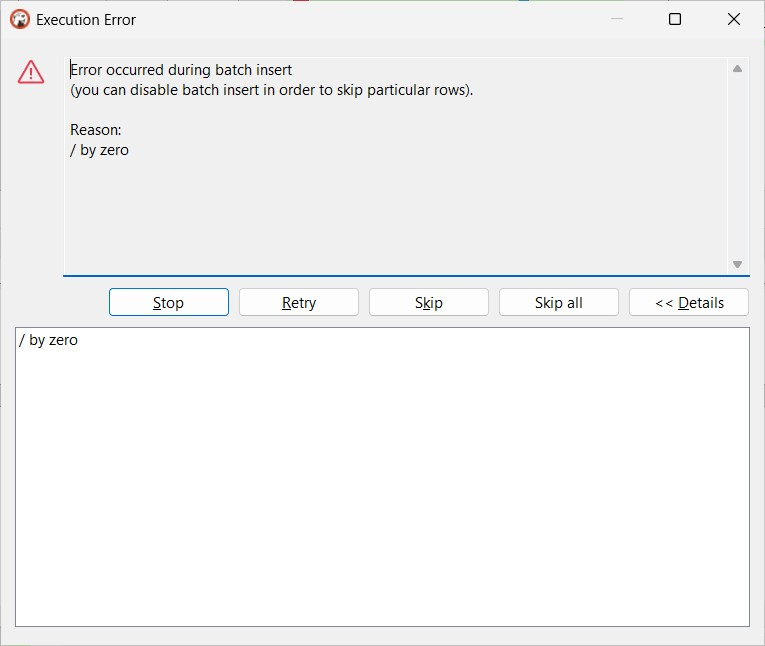

### “CopyTable — A Practitioner’s Sweat and Tears in Data Migration” <br />
*The ideals of seamless migration versus the hard reality of mismatches and reconciliation*


> "Freedom is the possibility of isolation. You are free if you can withdraw from people, not having to seek them out for the sake of money, company, love, glory or curiosity, none of which can thrive in silence and solitude. If you can’t live alone, you were born a slave."<br /><br />"A liberdade é a possibilidade do isolamento. És livre se podes afastar-te dos homens, sem que te obrigue a procurá-los a necessidade do dinheiro, ou a necessidade gregária, ou o amor, ou a glória, ou a curiosidade, que no silêncio e na solidão não podem ter alimento. Se te é impossível viver só, nasceste escravo."<br/>--- The Book of Disquiet by Fernando Pessoa


#### Prologue 
*Copying tables is easy for talkers but not for doers*. Database table looks like worksheet in Excel, and the copying is alike, many people thinks so... I was responsible for creating database tables and moving data betwixt and between. Here is my observation: 

1. Some people prefers to add additional columns in `PROD` or other environments to keep track of the data; 
2. Schemas on source and target database may not align properly;
3. Foreign keys are used to enfore integrity and thus impedes erasing data; 
4. Most data migrations are on on an ad hoc basis and can't be integrated with CI/CD. 

#### I. [Task management](https://dbeaver.com/docs/dbeaver/Task-Management/)
> Use tasks to save and reuse configurations for database tools like data transfer or import/export. Tasks help you automate routine actions and run them with one click. You can create tasks from tool wizards or from the main menu, group them in folders, and manage them in a dedicated view.

> This feature is available in Community, Enterprise, and Ultimate editions only.



The problem with Tasks is when importing redacted data, some fields may trigger error like so: 



In this case, export in SQL source and load it on target database is the only solution. 

> Alongside that, DBeaver provides **Common** tasks. They work with any supported database and cover typical cross-database workflows:

| Task | Description |
| --- | --- |
| Composite task | Run multiple tasks as a single workflow. |
| Data compare | Compare data between sources and review differences. |
| Data export | Export data to files or external targets. |
| Data import | Import data from files. |
| Mock data | Generate test data. |
| SQL Script | Execute one or more SQL scripts automatically. |
| Schema changelog | Create a changelog for selected data containers. |
| Schema compare | Compare database metadata between schemas or databases. |
| Shell command | Run a shell command as part of a task. |

Tasks can be scheduled or run from the command line. It is a indispensable tool on data migration. 


#### II. 

PROD → DEV → (Redact) → UAT 

#### III. 

#### IV. 

#### V. 

#### VI. 

#### VII.

#### VIII. 

#### Bibliography 
1. [DBeaver Documentatin Task Management](https://dbeaver.com/docs/dbeaver/Task-Management/)


#### Epilogue 
> "Death is a liberation because to die is to need no one. In death the wretched slave is forcibly set free from his pleasures, from his sufferings, from his coveted and ongoing life."

> "A morte é uma libertação porque morrer é não precisar de outrem. O pobre escravo vê-se livre à força dos seus prazeres, das suas mágoas, da sua vida desejada e contínua."


### EOF (2026/xx/xx)


#### 📂 Source schema: `DCDEVDTA.CUSTOMERS`
```
CREATE TABLE DCDEVDTA.CUSTOMERS (
    CUST_ID     INTEGER       NOT NULL,
    NAME        VARCHAR(50),
    EMAIL       VARCHAR(100),
    PHONE       VARCHAR(20),
    ADDRESS     VARCHAR(200),
    BIRTHDATE   DATE,          -- Date type
    STATUS      CHAR(1),
    CONSTRAINT PK_CUSTOMERS PRIMARY KEY (CUST_ID)
);

-- Five sample inserts
INSERT INTO DCDEVDTA.CUSTOMERS VALUES (1, 'Alice Chan', 'alice@example.com', '853-123456', 'Rua Central, Macau', DATE '1990-05-10', 'A');
INSERT INTO DCDEVDTA.CUSTOMERS VALUES (2, 'Bob Wong',   'bob@example.com',   '853-654321', 'Avenida Lisboa, Macau', DATE '1985-11-22', 'I');
INSERT INTO DCDEVDTA.CUSTOMERS VALUES (3, 'Cathy Lam',  'cathy@example.com', '853-777777', 'Coloane Village, Macau', DATE '1978-03-05', 'A');
INSERT INTO DCDEVDTA.CUSTOMERS VALUES (4, 'David Ho',   'david@example.com', '853-888888', 'Taipa Houses, Macau', DATE '1992-09-09', 'A');
INSERT INTO DCDEVDTA.CUSTOMERS VALUES (5, 'Eva Lei',    'eva@example.com',   '853-999999', 'Macau Tower Road', DATE '1980-12-31', 'I');
```


#### 📂 Target schema: `DCUATDTA.CUSTOMERS`
```
CREATE TABLE DCUATDTA.CUSTOMERS (
    CUSTOMER_ID INTEGER       NOT NULL,
    NAME        VARCHAR(50),
    EMAIL_ADDR  VARCHAR(100),
    PHONE       VARCHAR(20),
    CITY        VARCHAR(100),
    BIRTHDAY    DECIMAL(8,0),  -- Stored as YYYYMMDD number
    STATUS      CHAR(1),
    CREATED_AT  DATE,
    CONSTRAINT PK_CUSTOMERS PRIMARY KEY (CUSTOMER_ID)
);

-- Five sample inserts
INSERT INTO DCUATDTA.CUSTOMERS VALUES (101, 'Charlie Ho', 'charlie@example.com', '853-111111', 'Macau', 19900101, 'A', DATE '2020-01-01');
INSERT INTO DCUATDTA.CUSTOMERS VALUES (102, 'Diana Lei',  'diana@example.com',   '853-222222', 'Taipa', 19851122, 'A', DATE '2021-02-15');
INSERT INTO DCUATDTA.CUSTOMERS VALUES (103, 'Eric Chan',  'eric@example.com',    '853-333333', 'Coloane', 19780305, 'I', DATE '2022-03-20');
INSERT INTO DCUATDTA.CUSTOMERS VALUES (104, 'Fiona Wong', 'fiona@example.com',   '853-444444', 'Macau', 19920909, 'A', DATE '2023-04-10');
INSERT INTO DCUATDTA.CUSTOMERS VALUES (105, 'George Lam', 'george@example.com',  '853-555555', 'Taipa', 19801231, 'I', DATE '2024-05-05');
```


#### 🔍 Intersection vs. Differences
- **Shared fields (same name & type):**  
  - `NAME`  
  - `PHONE`  
  - `STATUS`  

- **Different fields:**  
  - `CUST_ID` vs. `CUSTOMER_ID`  
  - `EMAIL` vs. `EMAIL_ADDR`  
  - `ADDRESS` vs. `CITY`  
  - `BIRTHDATE` (DATE) vs. `BIRTHDAY` (DECIMAL(8,0))  
  - `CREATED_AT` (only in target)  

`files.txt`
```
CUSTOMERS
```

Run with: 
```
node src/dumpTable.js DCDEVDTA DCUATDTA files.txt truncate
```

CUSTOMERS_20260716165133.sql
```
-- Dump for DCDEVDTA.CUSTOMERS at 2026-07-16T08:09:18.455Z
TRUNCATE TABLE DCUATDTA.CUSTOMERS;

INSERT INTO DCUATDTA.CUSTOMERS (NAME, PHONE, STATUS) VALUES ('Alice Chan', '853-123456', 'A');
INSERT INTO DCUATDTA.CUSTOMERS (NAME, PHONE, STATUS) VALUES ('Bob Wong', '853-654321', 'I');
INSERT INTO DCUATDTA.CUSTOMERS (NAME, PHONE, STATUS) VALUES ('Cathy Lam', '853-777777', 'A');
INSERT INTO DCUATDTA.CUSTOMERS (NAME, PHONE, STATUS) VALUES ('David Ho', '853-888888', 'A');
INSERT INTO DCUATDTA.CUSTOMERS (NAME, PHONE, STATUS) VALUES ('Eva Lei', '853-999999', 'I');

-- Records dumped: 5, Lines written: 9
```

### EOF (2026/07/17)