### “CopyTable — A Practitioner’s Sweat and Tears in Data Migration” <br />
*The ideals of seamless migration versus the hard reality of mismatches and reconciliation*


> "Freedom is the possibility of isolation. You are free if you can withdraw from people, not having to seek them out for the sake of money, company, love, glory or curiosity, none of which can thrive in silence and solitude. If you can’t live alone, you were born a slave."<br /><br />"A liberdade é a possibilidade do isolamento. És livre se podes afastar-te dos homens, sem que te obrigue a procurá-los a necessidade do dinheiro, ou a necessidade gregária, ou o amor, ou a glória, ou a curiosidade, que no silêncio e na solidão não podem ter alimento. Se te é impossível viver só, nasceste escravo."<br/>--- The Book of Disquiet by Fernando Pessoa


#### Prologue 
*Copying tables is easy for talkers but not for doers*. Database table looks like worksheet in Excel, and the copying is alike, many people thinks so... I was responsible for creating database tables and moving data betwixt and between. Here is my observation: 

1. Some people adds extra columns on tables for monitoring purpose; 
2. Schemas may not align properly, either in *name* or *type*;
3. Foreign keys are used to enfore integrity which impedes erasing data; 
4. Most data copying tools are on ad hoc basis and not systematic ways. 


#### I. [DBeaver Task management](https://dbeaver.com/docs/dbeaver/Task-Management/)
Currently, the main tool to export/import tables between connections is **Task** in [DBeaver](https://dbeaver.io/). 

> Use tasks to save and reuse configurations for database tools like data transfer or import/export. Tasks help you automate routine actions and run them with one click. You can create tasks from tool wizards or from the main menu, group them in folders, and manage them in a dedicated view.

> This feature is available in Community, Enterprise, and Ultimate editions only.

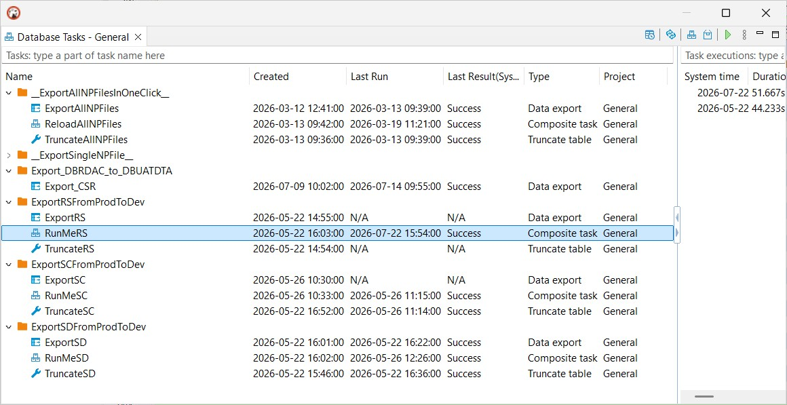

> Alongside that, DBeaver provides **Common** tasks. They work with any supported database and cover typical cross-database workflows:

| Task | Description |
| --- | --- |
| Composite task | Run multiple tasks as a single workflow. |
| Data compare | Compare data between sources and review differences. |
| Data export | Export data to files or external targets. |
| Data import | Import data from files. |
| Mock data | Generate test data. |
| SQL Script | Execute one or more SQL scripts automatically. |
| Schema changelog | Create a changelog for selected data containers. |
| Schema compare | Compare database metadata between schemas or databases. |
| Shell command | Run a shell command as part of a task. |

**Tasks can be scheduled or executed from the command line. They are an indispensable tool for day‑to‑day data migration.**

However, importing redacted data with Tasks may trigger error like so: 

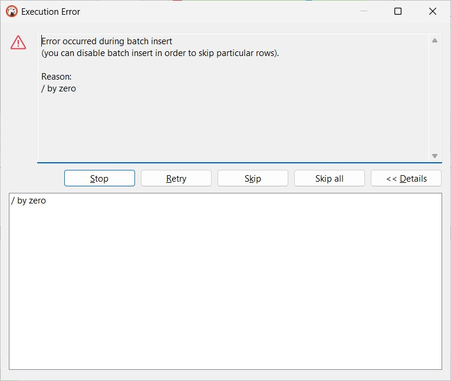

Inserting redacted data with `INSERT` triggers error like so: 

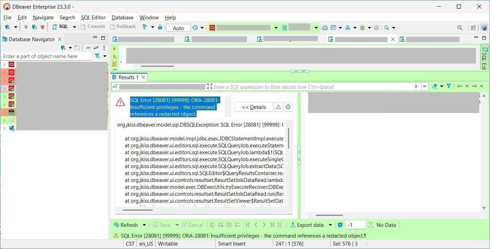

The only way is to export tables in SQL source and load them into target database. 


#### II. A typical workflow 
Following is a workflow involved in moving data from `PROD` to `UAT`, ie: 
```
PROD → DEV → (Redact) → UAT 
```
Here is my main concern: 
- **Error detection**: identify which table rows incur the failure; 
- **Failure retry**: *partially* re-do, not total *undo* and *redo*; 
- **Target verify**: ensure identity on both sides; 
- **Optimize copy**: identify which tables have been changed since last copy and only copy them again on next round; 
- **Observably**: when row changed detected, what is the pair of rows looks like. 

Let's get started! First thing first, clone the repository from [here](https://github.com/Albert0i/CopyTable/tree/main). Next, create an `.env` file like so: 
```
SOURCE_ORACLEDB_USER=<source user>
SOURCE_ORACLEDB_PASSWORD=<source password>
SOURCE_ORACLEDB_CONNECTIONSTRING=<source connection string>

TARGET_ORACLEDB_USER=<target user>
TARGET_ORACLEDB_PASSWORD=<target password>
TARGET_ORACLEDB_CONNECTIONSTRING=<target connection string>

DATABASE=./data/hash_tracker.db
```

And then, test connection with: 
```
npm test 
```

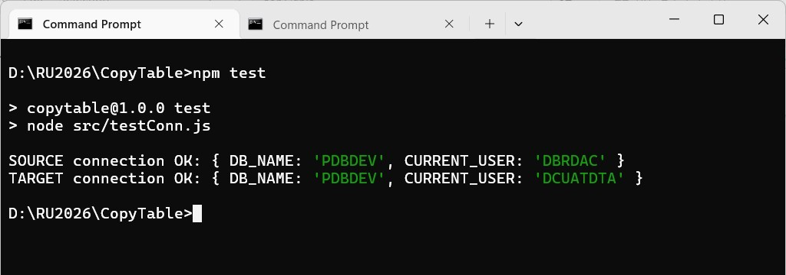

**Warning**: Setting the wrong direction may cause a disaster. 


#### III. DumpTable and InsertTable
To dump all tables enlisted on `files.txt` from source database into `./data` folder, optionally add `TRUNCATE` on top of `INSERT`.
```
Usage:
  node src/dumpTable.js <source schema> <target schema> <files.txt> [truncate]

Example:
  node src/dumpTable.js DCDEVDTA DCUATDTA files.txt truncate
```

`dumpTable.js` would first get the columns name and type on both sides, compute the *common columns* which are supposed to have the same name and type (`CHAR` and `VARCHAR2` are considered the same), in addition all managerial fields are stripped off. 

And then, It queries source database in batch mode, format, compose and output `INSERT` statement like so: 
```
        for (const row of result.rows) {
          const vals = commonCols.map(c => {
                  let v = formatValue(row[c]);
                  // 🔧 sanitize embedded linebreaks
                  if (typeof v === 'string') {
                    v = v.replace(/\r?\n/g, ' '); // replace newline with space
                  }
                  return v;
                }).join(', ');
          const insertSQL = `INSERT INTO ${targetSchema}.${table} (${commonCols.join(', ')}) VALUES (${vals});\n`;
          writeStream.write(insertSQL);
          rowCount++;
        }
```

To insert SQL dumps into target database.
```
Usage:
  node src/insertTable.js <sourceFolder>

Example:
  node src/insertTable.js H:\\UAT
```

The implementation of `insertTable.js` is straightforward, reads and runs, writes failure log if come accors error. You can run `insertTable.js` with any folder parameter, in this way, you can reuse the SQL dumps created by DBeaver. 


#### IV. CopyTable
To copy all tables enlisted on `files.txt` from source database into target database, optionally truncate target table before insert. 
```
Usage:
  node src/copyTable.js <source schema> <target schema> <files.txt> [truncate]

Example:
  node src/copyTable.js DCDEVDTA DCUATDTA files.txt truncate
```

`copyTable.js` is a composite of `dumpTable.js` and `insertTable.js` without leave SQL dump files. The same read logic as `dumpTable.js` and the same write logic as `insertTable.js`, it is a cleaner approach if your sole purpose is copying tables. 


#### V. BuildHashes
*Copying tables is tedious; verifying them is pure drudgery.* My observation is: 
- How can you be so sure that all data are identical? 
- Simply judging from the rows count is not enough; 
- How can you read out and verify rows without knowing the primary key (if any) beforehand?

**MY ASSUMPTION**

if the storage of source and target tables unchanged, querying the table without specifying `ORDER BY` gives the *deterministic* result! 

My idea is simple: an RDBMS always completes your query with minimal effort — least CPU, least I/O, least RAM — and delivers whatever the result to the user as quickly as possible. He is a mean guy and reluctant to spend extra resources to fulfill your request! He never spends a single extra penny on you!

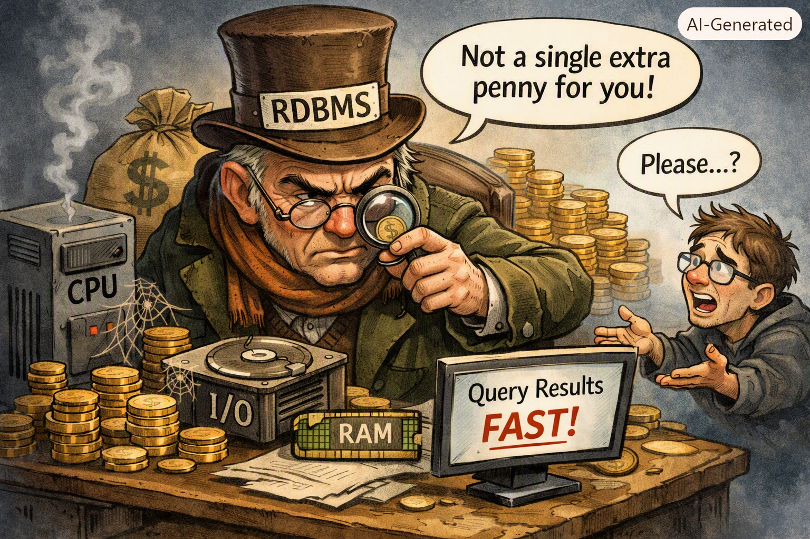

**WARNINGS FROM AI**

> When a database remains unchanged, selecting from a table without an `ORDER BY` clause often appears to return rows in their “arrival sequence,” typically reflecting insertion order or clustered index layout. This behavior can seem stable and repeatable, giving the impression of determinism.

> However, SQL standards do not guarantee row order unless explicitly defined, and internal operations such as index rebuilds, statistics updates, or storage reorganizations may alter the sequence unexpectedly. Thus, while the output may look consistent in an untouched database, practitioners should treat it as incidental rather than deterministic, and enforce ordering when reliability is required.

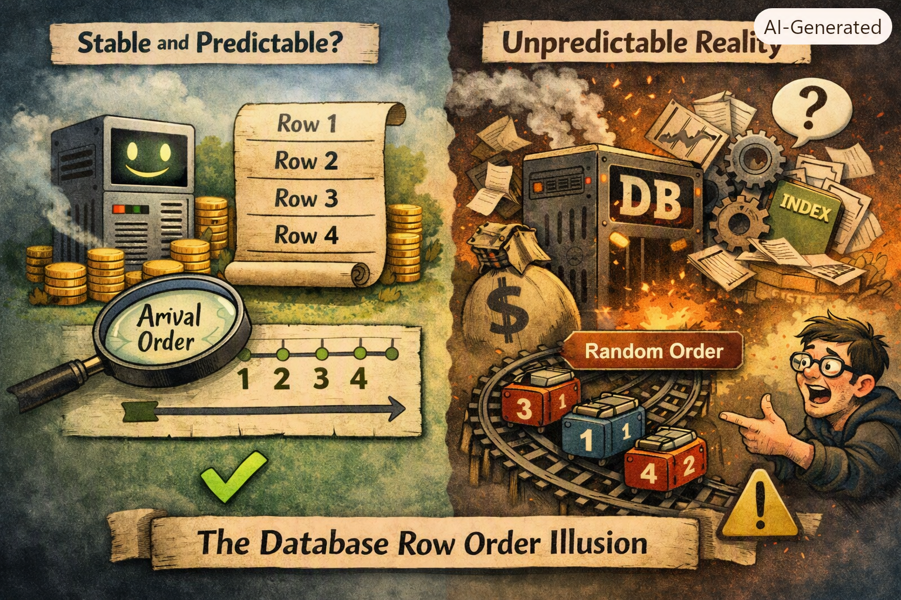

We calculate hashes for common columns of all rows on all tables on both sides. By grouping and counting hash value, we can effectively partition all rows into **hash segments**: 
- If one hash segment has the same row count on both sides, it is supposed that this segment is identical; 
- If the other hash segment has different row count, ie. abs(source_count - target_count) ≠ 0, for example, that hash segment has at least one rows changes; 
- If all hash segments have the same rows count, then both side are identical. 

We use SQLite to store hashes of both sides (as you may know SQLite is my best friend):
```
CREATE TABLE IF NOT EXISTS hash_tracker (
  id             INTEGER PRIMARY KEY AUTOINCREMENT,
  schema_name    TEXT NOT NULL,        -- actual schema name, e.g. DCDEVDTA
  schema_type    TEXT NOT NULL,        -- 'SOURCE' or 'TARGET'
  table_name     TEXT NOT NULL,        -- table being hashed
  common_columns TEXT,                 -- list of columns used for hashing
  row_seq        INTEGER NOT NULL,     -- starts at 1 for each table
  hash_value     TEXT NOT NULL,        -- computed fingerprint of row content
  created_at     DATETIME DEFAULT CURRENT_TIMESTAMP
);

CREATE INDEX IF NOT EXISTS idx_hash_tracker_schema_table
  ON hash_tracker(schema_name, table_name, row_seq);

CREATE INDEX IF NOT EXISTS idx_hash_tracker_hash
  ON hash_tracker(hash_value);
```

To build hashes on all tables enlisted on `files.txt`, source schema is `DCDEVDTA`, target schema is `DCUATDTA`. 
To build hashes on all tables enlisted on `files.txt` with source database and target database.

```
node src/buildHashes.js DCDEVDTA DCUATDTA files.txt
```

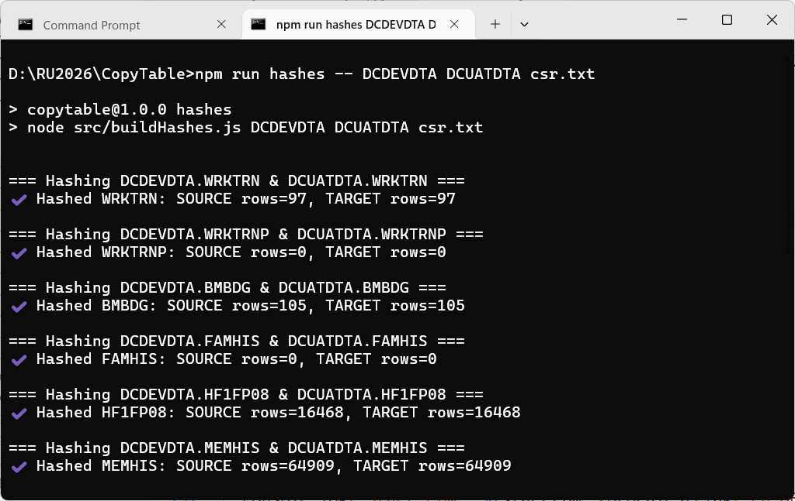

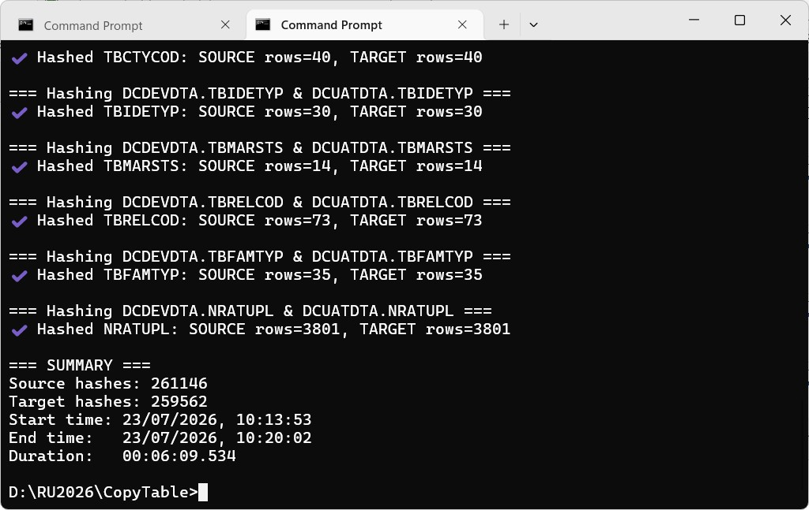


#### VI. VerifyTable
Based on the hashes, we can verify rows count on both sides. 
```
-- Per-table row count comparison
SELECT table_name,
       MAX(CASE WHEN schema_type='SOURCE' THEN cnt END) AS source_rows,
       MAX(CASE WHEN schema_type='TARGET' THEN cnt END) AS target_rows
FROM (
    SELECT table_name, schema_type, COUNT(*) AS cnt
    FROM hash_tracker
    GROUP BY table_name, schema_type
) t
GROUP BY table_name
HAVING source_rows != target_rows;
```

Next, the hash segment summary. 
```
-- Per-table hash distribution comparison Summary
SELECT table_name
FROM (
    SELECT table_name,
           hash_value,
           SUM(CASE WHEN schema_type='SOURCE' THEN 1 ELSE 0 END) AS source_count,
           SUM(CASE WHEN schema_type='TARGET' THEN 1 ELSE 0 END) AS target_count
    FROM   hash_tracker
    GROUP BY table_name, hash_value
    HAVING source_count != target_count
) sub
GROUP BY table_name
ORDER BY table_name;
```

At last, the hash segment details. 
```
-- Per-table hash distribution comparison
SELECT table_name,
       hash_value,
       SUM(CASE WHEN schema_type='SOURCE' THEN 1 ELSE 0 END) AS source_count,
       SUM(CASE WHEN schema_type='TARGET' THEN 1 ELSE 0 END) AS target_count
FROM   hash_tracker
GROUP BY table_name, hash_value
HAVING source_count != target_count
ORDER BY table_name, hash_value;
```

To verify the hashes on all tables. 
```
node src/verifyCopy.js
```

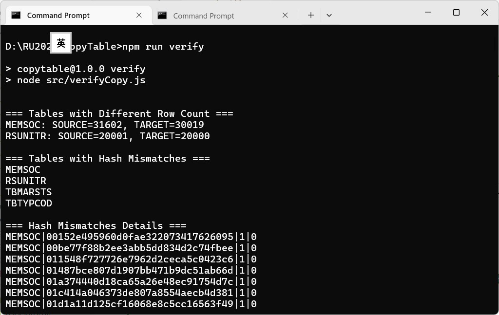

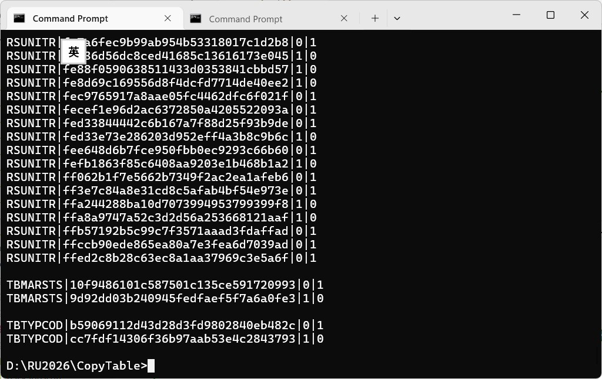

The previous screens show: 
1. `MEMSOC` and `RSUNITR` have different rows counts; 
2. `TBMARSTS` and `TBTYPCOD` have at least one row changed; 
3. All hash segments with `source_count` not equal to `target_count`; 


#### VII. RowMismatch 
*Detecting rows changed is challenging, identifying the actual changed rows is a greater challenge.* To find out mismatch rows on tables of both sides. 
```
node src/rowMismatch.js
```

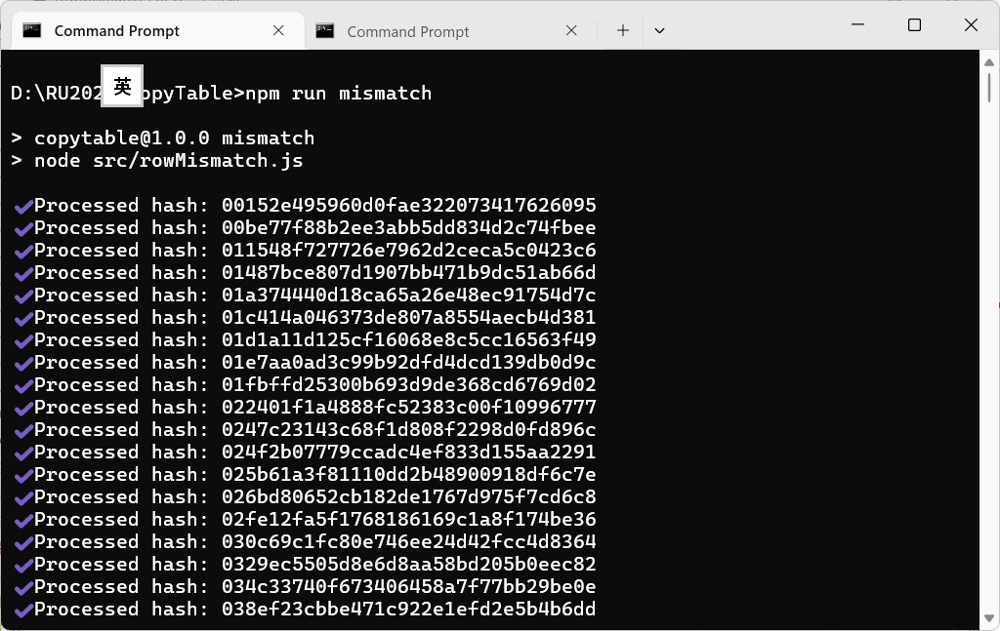

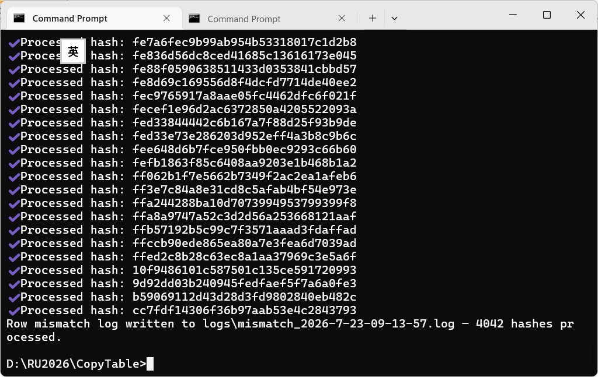

Open `mismatch_2026-7-23-09-13-57.log` on `/logs` folder. 

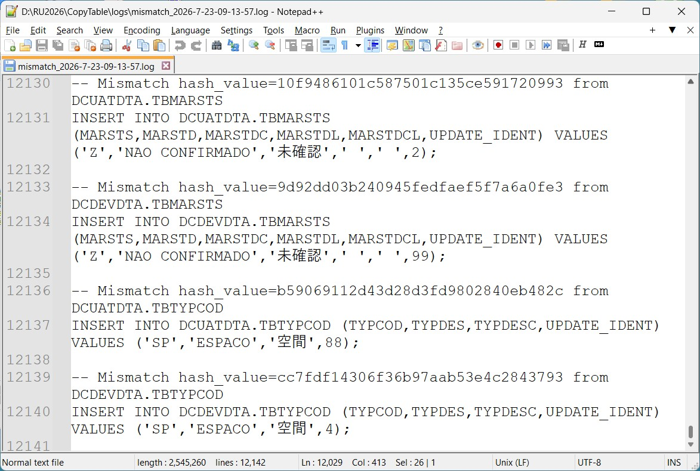


#### VIII. RowMismatch (Explained)
For all hash segments, query `hash_tracker` again to get details:
```
SELECT schema_name, schema_type, table_name, common_columns, row_seq 
FROM hash_tracker 
WHERE table_name=<table_name> AND hash_value=<hash_value> 
ORDER BY schema_name, table_name
```

For all segment details, query Oracle source/target schema: 
```
SELECT <common_columns>
FROM <schema_name>.<table_name>
OFFSET <row_seq> - 1 ROWS FETCH FIRST 1 ROWS ONLY
```

From a low‑level perspective, a database is essentially a colossal composite of data structures, I don't think RDBMS would ever tread on the land of **Probabilistic data structures**. During the stage of hash building, every row is read and assigned a `row_seq`, this very number is crucial for later retrieval provided that the row order remains **deterministic** and this is where my assumption lies. 


#### IX. Summary 
The use of hashes to verify file integrity is common practice in internet downloads. The use of hashes to verity row identity is inspired by AI, while the use of `row_seq` to locate the actual changed rows is based on my understanding on database storage and data retrieval. It's not a 100% guarantee but happens to work in my case... It's a guess and a bet!


#### X. Bibliography 
1. [DBeaver Task Management](https://dbeaver.com/docs/dbeaver/Task-Management/)
2. [Introduction to Oracle Data Redaction](https://docs.oracle.com/en/database/oracle/oracle-database/19/asoag/introduction-to-oracle-data-redaction.html)
3. [The Book of Disquiet by Fernando Pessoa](https://dn720004.ca.archive.org/0/items/english-collections-1/Book%20of%20Disquiet%2C%20The%20-%20Fernando%20Pessoa.pdf)


#### Epilogue 
> "Death is a liberation because to die is to need no one. In death the wretched slave is forcibly set free from his pleasures, from his sufferings, from his coveted and ongoing life."

> "A morte é uma libertação porque morrer é não precisar de outrem. O pobre escravo vê-se livre à força dos seus prazeres, das suas mágoas, da sua vida desejada e contínua."


### EOF (2026/07/31)
