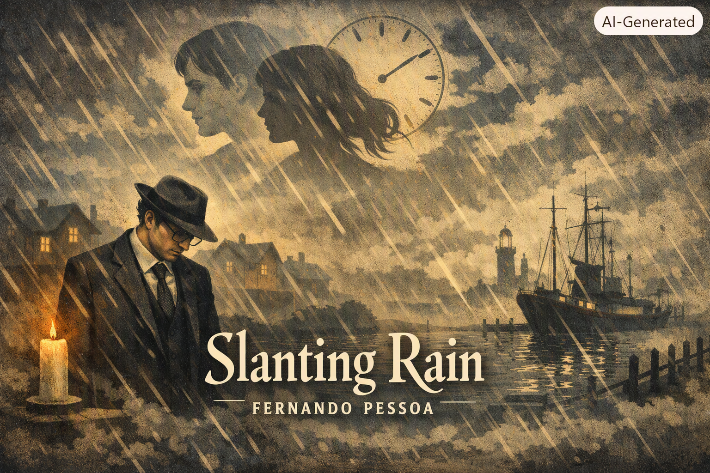

### 🌧️ Introduction: Pessoa, Álvaro de Campos, and the Oblique Rain

Fernando Pessoa (1888–1935) is one of the most enigmatic figures in modernist literature. His genius lies not only in the poems themselves but in the invention of **heteronyms** — alternative poetic personalities with distinct voices, philosophies, and styles. Among them, Álvaro de Campos is the most restless, experimental, and anguished. Campos’s poetry ranges from futurist exaltations of machines to despairing meditations on alienation. *Slanting Rain* (*Chuva Oblíqua*), published in 1929, belongs to this latter mode: fragmented, surreal, and deeply unsettling.

The title itself — “Slanting Rain” — sets the tone. Rain normally falls vertically, a symbol of natural order. But here it falls obliquely, skewed, distorted, unnatural. This obliqueness becomes a metaphor for existence itself: reality is never straightforward, always refracted, always askew. The poem is divided into six sections, each presenting dreamlike images where landscapes, houses, figures, and inner states blur together. It is not a narrative but a sequence of visions, each fragment contributing to a cumulative sense of dissonance.

#### 🌊 Section I: The Infinite Harbor

The opening section introduces one of Pessoa’s recurring motifs: the harbor. For Campos, harbors symbolize infinity, longing, and the restless desire for departure. In *Slanting Rain*, the harbor is imagined as endless, stretching beyond perception. Yet this dream is blurred by the slanting rain, which distorts outlines and makes clarity impossible.

Here Pessoa sets up the central tension: the yearning for infinity versus the impossibility of grasping it. The rain is not just weather; it is the agent of distortion, the metaphor for oblique existence. The harbor dream cannot be seen clearly, only half‑perceived through the rain’s veil. This section establishes the poem’s surreal tone: landscapes are not stable realities but dream projections, always unstable, always dissolving.

Pessoa begins with the dream of a harbor that seems endless. Harbors in Álvaro de Campos’s poetry are symbols of longing, departure, and infinity. Here, though, the outlines are blurred by the slanting rain. The harbor is not a clear vision but a distorted dream.  

**Imagery:**  
- The harbor stretches beyond perception.  
- Rain blurs outlines, making the dream unstable.  

**Symbolism:**  
- Harbor = infinity, longing for transcendence.  
- Rain = distortion, obliqueness, impossibility of clarity.  

**Interpretation:**  
Campos yearns for infinity but finds only distortion. The rain makes the dream oblique, symbolizing the impossibility of direct access to transcendence. This sets the tone for the entire poem: reality and dream are always refracted, never clear.

#### 🏠 Section II: Dissolving Houses and Fields

The second section shifts from the harbor to more domestic imagery: houses, fields, and figures. Yet these too are unstable. The rain blurs them, dissolves them, makes them dreamlike. The poet perceives them but cannot hold them steady. They appear and vanish, like hallucinations.

This section emphasizes fragmentation. Traditional poetry might describe a landscape with coherence, but Pessoa deliberately breaks it apart. The rain is oblique, so perception itself is oblique. The houses are not homes; they are fleeting apparitions. The fields are not fertile; they are dream fragments. The rain undermines solidity, turning reality into a surreal collage.

The second fragment shifts to domestic imagery: houses, fields, figures. Yet these too dissolve in the rain. They appear and vanish, like hallucinations.  

**Imagery:**  
- Houses blurred, fields dissolving.  
- Figures fleeting, unstable.  

**Symbolism:**  
- Domesticity = stability, fertility.  
- Rain dissolves them, undermining solidity.  

**Interpretation:**  
Campos cannot find stability even in domestic landscapes. The rain makes everything oblique, turning homes into apparitions. This dramatizes fragmentation: reality itself is unstable, always dissolving under the rain’s distortion.

#### 💭 Section III: Inner Confusion

The third section turns inward. The external rain becomes a mirror of internal turmoil. Campos’s voice is restless, anxious, modernist. He feels confusion, alienation, dissonance. The rain outside is oblique; the mind inside is equally oblique. There is no harmony between inner and outer worlds — both are skewed, both are distorted.

Here Pessoa dramatizes the modernist condition: the collapse of coherence, the impossibility of unity. The poet cannot find clarity either in the world or in himself. Rain becomes the metaphor for consciousness itself: falling at an angle, never straight, never pure. This section deepens the existential unease introduced earlier.

The third section turns inward. The external rain mirrors internal turmoil. Campos feels confusion, alienation, dissonance.  

**Imagery:**  
- Rain outside is oblique.  
- Mind inside is equally oblique.  

**Symbolism:**  
- Rain = consciousness itself, falling at an angle.  
- Inner turmoil = existential unease.  

**Interpretation:**  
Campos cannot find clarity either in the world or in himself. Rain becomes the metaphor for consciousness: skewed, distorted, never pure. This dramatizes the modernist condition: collapse of coherence, impossibility of unity.

#### 🌌 Section IV: Collisions of Dreams

The fourth section presents collisions of dream fragments. Different visions overlap, like multiple realities superimposed. The poet perceives landscapes, figures, and inner states all at once, but they do not cohere. Instead, they clash, overlap, dissolve. The rain is the agent of this collision, blurring boundaries and making everything oblique.

This section resonates with Pessoa’s heteronymic multiplicity. Just as Pessoa invented multiple poetic selves, here the poem presents multiple dream fragments that cannot be unified. Reality itself is heteronymic: multiple, fragmented, irreconcilable. The rain symbolizes this multiplicity, this obliqueness of existence.

The fourth section presents overlapping dream fragments. Different visions collide, like multiple realities superimposed.  

**Imagery:**  
- Landscapes, figures, inner states overlapping.  
- Dreams colliding, dissolving.  

**Symbolism:**  
- Overlapping dreams = heteronymic multiplicity.  
- Rain = agent of collision, blurring boundaries.  

**Interpretation:**  
Reality itself is heteronymic: multiple, fragmented, irreconcilable. Just as Pessoa invented multiple poetic selves, the poem presents multiple dream fragments that cannot be unified. Rain symbolizes this multiplicity, this obliqueness of existence.

#### 🕯️ Section V: Alienation

The fifth section intensifies the existential alienation. The poet feels estranged not only from reality but from his own dreams. He cannot inhabit either world. The rain makes both external landscapes and internal visions oblique, distorted, inaccessible. Alienation becomes total: the poet is cut off from both reality and imagination.

This section reflects Campos’s anguished voice. Unlike Pessoa’s other heteronyms (such as Alberto Caeiro, who finds peace in nature), Campos is tormented by dissonance. He longs for clarity but finds only obliqueness. The rain becomes the symbol of this estrangement: it falls at an angle, never straight, never allowing harmony.

The fifth section intensifies alienation. Campos feels estranged from both reality and his own dreams.  

**Imagery:**  
- Landscapes and dreams both oblique.  
- Alienation total, estrangement complete.  

**Symbolism:**  
- Rain = estrangement, impossibility of harmony.  
- Alienation = modernist dissonance.  

**Interpretation:**  
Campos longs for clarity but finds only obliqueness. Alienation becomes total: he is cut off from both reality and imagination. This reflects Campos’s anguished voice, tormented by dissonance.

#### 🌫️ Section VI: Closing Ambiguity

The final section offers no resolution. The rain continues slanting, the dreams continue dissolving, the alienation continues. The poem ends in ambiguity, leaving the reader unsettled. There is no closure, no harmony, no clarity. The rain remains oblique, symbolizing perpetual dissonance.

This ending is quintessentially modernist. Traditional poetry might resolve with a moral or a vision of unity. Pessoa refuses this. He leaves the reader in ambiguity, reflecting the modern condition of fragmentation and alienation. The rain continues slanting, forever oblique.

The final section offers no resolution. The rain continues slanting, dreams continue dissolving, alienation continues.  

**Imagery:**  
- Rain falling obliquely, endlessly.  
- Dreams dissolving, ambiguity total.  

**Symbolism:**  
- Rain = perpetual dissonance.  
- Ending = refusal of closure.  

**Interpretation:**  
Pessoa refuses resolution. The poem ends in ambiguity, leaving the reader unsettled. This is quintessentially modernist: no moral, no unity, only perpetual obliqueness.

#### 📚 Literary Significance

*Slanting Rain* is one of Pessoa’s most radical modernist experiments. It breaks traditional poetic unity, presenting fragmented visions instead of coherent narratives. It uses surreal imagery to dramatize existential unease. It reflects Pessoa’s heteronymic multiplicity, presenting overlapping realities that cannot be unified. It embodies modernist dissonance, refusing closure and leaving the reader in ambiguity.

The poem is significant not only for its imagery but for its philosophical resonance. The slanting rain becomes a metaphor for existence itself: reality is never straightforward, always refracted, always oblique. The poem dramatizes the impossibility of clarity, the inevitability of alienation, the perpetual condition of dissonance.

#### 🧩 Symbolic Interpretations

- **Rain:** Symbol of distortion, obliqueness, existential unease.  
- **Harbor:** Symbol of infinity, longing, departure.  
- **Houses and fields:** Symbols of domesticity and fertility, but dissolved by rain.  
- **Dream fragments:** Symbols of heteronymic multiplicity, overlapping realities.  
- **Alienation:** Central theme, dramatized by oblique rain.  
- **Ambiguity:** Modernist refusal of closure, leaving the reader unsettled.

#### 🌍 Philosophical Resonance

Pessoa’s *Slanting Rain* resonates with broader modernist philosophy. It reflects the collapse of coherence, the impossibility of unity, the inevitability of alienation. It dramatizes the modern condition of fragmentation, multiplicity, dissonance. It embodies existential unease, reflecting the impossibility of clarity in both reality and consciousness.

The poem also resonates with Pessoa’s heteronymic philosophy. Just as Pessoa invented multiple poetic selves, the poem presents multiple dream fragments that cannot be unified. Reality itself is heteronymic: multiple, fragmented, irreconcilable. The rain symbolizes this multiplicity, this obliqueness of existence.

#### 🕊️ Conclusion

Fernando Pessoa’s *Slanting Rain* (*Chuva Oblíqua*) is a short poem cycle of six sections, but its resonance is vast. It uses surreal imagery to dramatize existential unease. It reflects Pessoa’s heteronymic multiplicity, presenting overlapping realities that cannot be unified. It embodies modernist dissonance, refusing closure and leaving the reader in ambiguity. The slanting rain becomes a metaphor for existence itself: reality is never straightforward, always refracted, always oblique.

#### 🕊️ Closing Reflection
Pessoa’s *Slanting Rain* is short in word count but vast in resonance. Its six sections present fragmented visions where reality and dream blur together. Rain becomes the central metaphor: oblique, distorted, refracted. Existence itself is slanting rain — never straightforward, always askew.  

### EOF 
