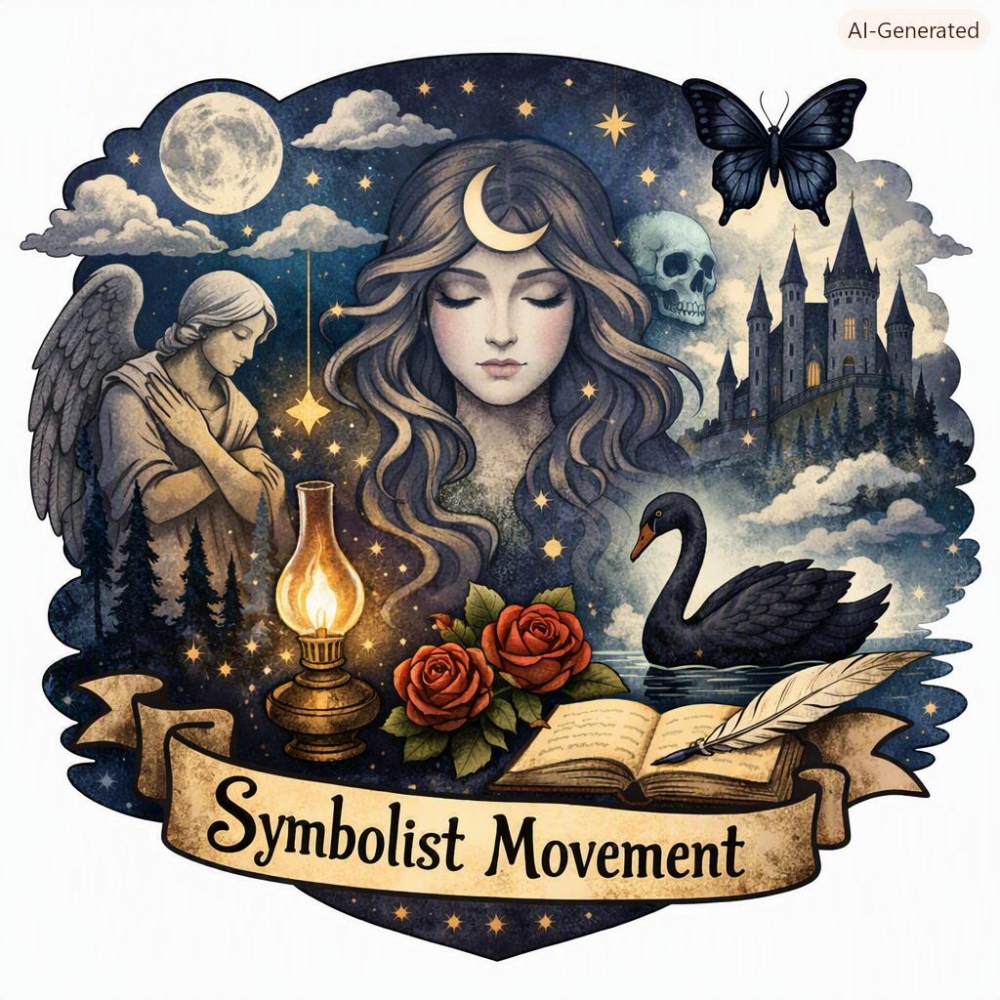

### Symbolism and Post‑Symbolism: A Simple Exploration

#### 🌌 Introduction
The term *Symbolist* and the *Symbolist movement* often sound intimidating, but at their heart they describe a group of artists and writers in the late 19th century who wanted art to be more than just a mirror of reality. They believed that everyday life was too plain, too literal, and that art should instead evoke moods, emotions, and hidden truths through symbols and metaphors. Later, the *post‑Symbolists* carried this spirit forward, reshaping it into modernist and experimental forms.  

This summary — written in simple terms and expanded to about 2,500 words — will explain Symbolism, its origins, its key figures, its artistic techniques, and how it evolved into post‑Symbolism. Along the way, I’ll use examples to make the ideas clear and relatable.

#### ⚙️ Part I: What Is Symbolism?
Symbolism was a cultural movement that began in France in the 1880s and spread across Europe. It was primarily literary, but it influenced painting, music, and theater as well.

- **Core Idea**: Instead of describing reality directly, Symbolists used symbols, metaphors, and dreamlike imagery to suggest deeper truths.  
- **Reaction Against Realism**: Realist writers and painters showed life “as it is” — factories, streets, ordinary people. Symbolists felt this was too shallow. They wanted art to reveal the invisible: emotions, spirituality, mystery.  
- **Mood Over Facts**: Symbolist works often feel like music — they don’t tell a straightforward story, but they create an atmosphere.  

👉 Example: A Realist poet might write, *“The factory whistle blows at dawn.”* A Symbolist poet might write, *“The iron throat cries to awaken the weary souls.”* The second line doesn’t just describe; it evokes a mood of oppression and melancholy.

#### ⚙️ Part II: Origins of the Movement
Symbolism grew out of dissatisfaction with two earlier trends:

1. **Naturalism**: Writers like Émile Zola focused on scientific observation of society. Symbolists found this too clinical.  
2. **Realism**: Artists like Gustave Flaubert depicted ordinary life with precision. Symbolists wanted mystery, not precision.  

The movement was also influenced by Romanticism, which valued emotion and imagination, but Symbolists pushed further into abstraction and suggestion.

#### ⚙️ Part III: Key Figures
- **Charles Baudelaire**: His later works, especially *Les Fleurs du mal* (*The Flowers of Evil*), inspired Symbolists with their dark, suggestive imagery.  
- **Stéphane Mallarmé**: Considered the “high priest” of Symbolism. His poetry is dense, musical, and often difficult, but it aims to evoke pure moods.  
- **Paul Verlaine**: Known for delicate, musical verse. He emphasized sound and rhythm over meaning.  
- **Arthur Rimbaud**: Though not strictly Symbolist, his visionary poems influenced the movement.  
- **Odilon Redon** (painting): Created dreamlike, surreal images — floating eyes, strange creatures — that embodied Symbolist aesthetics.  

#### ⚙️ Part IV: Techniques of Symbolist Art
Symbolists used several techniques to achieve their goals:

- **Metaphor and Symbol**: Everyday objects became symbols of inner states.  
- **Musicality**: Poetry was written to sound like music, with rhythm and tone more important than literal meaning.  
- **Dreamlike Imagery**: Strange, surreal pictures suggested mystery.  
- **Ambiguity**: Works often resist clear interpretation, inviting readers to feel rather than analyze.  

👉 Example: Mallarmé’s poem *“L’Azur”* speaks of the sky as a crushing, eternal presence. The sky is not just blue; it becomes a symbol of infinity and human despair.

#### ⚙️ Part V: Symbolism in Literature
Symbolist literature often avoids plot and focuses on mood.  

- **Themes**: Death, dreams, spirituality, melancholy, transcendence.  
- **Style**: Dense, metaphorical, musical.  
- **Impact**: Influenced later modernist writers like T.S. Eliot and James Joyce.  

👉 Example: Verlaine’s poem *“Clair de lune”* describes moonlight not as a physical phenomenon but as a mood of sadness and longing.

#### ⚙️ Part VI: Symbolism in Painting
Symbolist painters rejected realism and impressionism.  

- **Odilon Redon**: Painted strange visions — flowers with human eyes, floating heads.  
- **Gustave Moreau**: Used mythological subjects with rich, dreamlike detail.  
- **Edvard Munch**: Early works like *The Scream* show Symbolist influence — the figure is not realistic but expressive of inner terror.  

#### ⚙️ Part VII: Symbolism in Music
Composers like Claude Debussy were influenced by Symbolist poetry.  

- Debussy’s music often feels atmospheric, suggestive, and dreamlike.  
- He set Symbolist poems to music, emphasizing mood over narrative.  

#### ⚙️ Part VIII: Post‑Symbolism
By the early 20th century, Symbolism had evolved into new forms.  

- **Post‑Symbolism** refers to writers and artists who inherited Symbolist techniques but reshaped them into modernist styles.  
- They kept the dreamlike imagery but added fragmentation, philosophy, and experimentation.  
- Symbolism was about mystery; post‑Symbolism was about questioning existence itself.  

👉 Example: Fernando Pessoa, a Portuguese poet, began with Symbolist imagery but developed into a post‑Symbolist modernist, using multiple “heteronyms” (alternate identities) to explore fragmented consciousness.

#### ⚙️ Part IX: Example Comparison
- **Symbolist line**: *“The azure veil hides eternity.”*  
- **Post‑Symbolist line**: *“The sky is a broken mirror of my mind.”*  

The first evokes mystery through metaphor. The second reshapes the metaphor into a modernist reflection on consciousness.

#### ⚙️ Part X: Legacy
Symbolism influenced many later movements:

- **Modernism**: Writers like Eliot, Joyce, and Woolf inherited Symbolist techniques of suggestion and fragmentation.  
- **Surrealism**: Built on Symbolist dream imagery.  
- **Expressionism**: Took Symbolist emotional intensity into painting and theater.  

#### 🌠 Conclusion
In simple terms:  
- **Symbolism** = late 19th‑century art and literature that used symbols, metaphors, and dreamlike imagery to evoke hidden truths and moods.  
- **Symbolist movement** = the group of poets, painters, and composers who practiced this style.  
- **Post‑Symbolism** = the generation after Symbolism, who kept its spirit but reshaped it into modernist, philosophical, and experimental art.  

👉 Example takeaway: If Realism says *“the sky is blue,”* Symbolism says *“the azure veil hides eternity,”* and Post‑Symbolism says *“the sky is a broken mirror of my mind.”*

### EOF 
